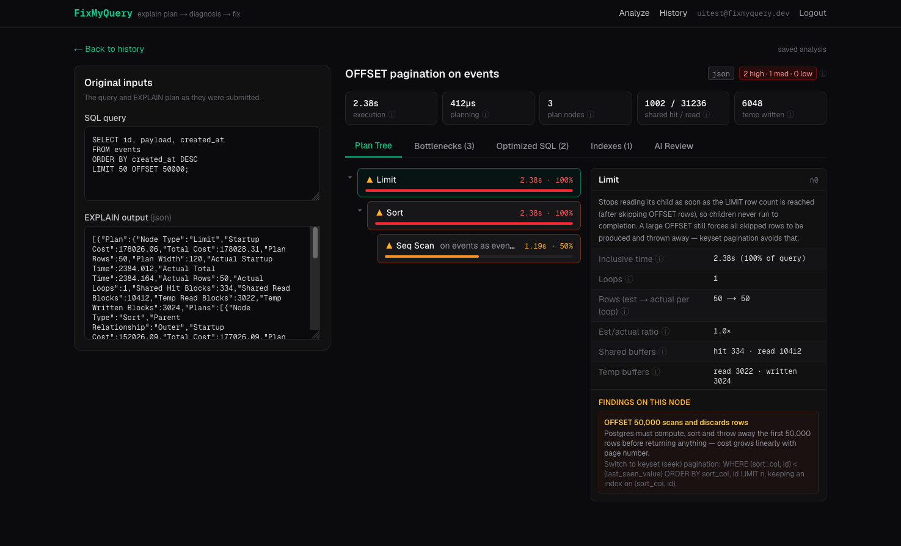

# FixMyQuery

Paste a slow Postgres query and its `EXPLAIN (ANALYZE, BUFFERS)` output. Deterministic plan rules find the bottlenecks first; a reasoning LLM — grounded in those measured numbers — explains them in plain English and proposes optimized SQL and `CREATE INDEX` statements. Every AI rewrite is syntax-checked with a real SQL parser before it's shown to you.



Live instance: **http://178.105.43.147/FixMyQuery** · Self-hosting: [deployment guide](ansible/README.md)

## The 30-second demo

```bash
docker compose up -d     # postgres :5432 + mailpit :8025
pnpm install
cp .env.example .env.local   # add your AI_API_KEY (any OpenAI-compatible provider)
pnpm db:generate && pnpm db:migrate
pnpm dev                 # http://localhost:3000
```

Register → click the verification link in the [Mailpit inbox](http://localhost:8025) → sign in → pick a sample scenario → **Analyze query**. You get an interactive plan tree with time-share bars, deterministic findings, AI-verified bottlenecks, validated SQL rewrites, index proposals, and the model's full reasoning. An account is required (analyses are persisted per user); the deterministic rules run regardless of the AI stage's health.

## Why this isn't just "wrap an LLM around EXPLAIN"

Existing tools pick a lane: [explain.depesz.com](https://explain.depesz.com/) and [pev2](https://github.com/datafold/pev2) visualize plans but don't explain fixes; EverSQL and pgMustard propose fixes as black boxes. FixMyQuery combines both with an explicit **trust chain**:

```
EXPLAIN (ANALYZE, BUFFERS) output (JSON or text)
        │
        ▼
1. parse            normalized PlanNode tree + totals (two parsers, tested)
2. metrics          per-node inclusive time × loops, % of query, est-vs-actual ratio
3. deterministic    7 rules → Findings { nodeId, severity, evidence, suggestion }
   rules            ── pure functions, no LLM, no network, cannot hallucinate
        │
        ▼
4. prompt           compact one-line-per-node outline + findings + totals
   compaction       (the LLM never sees raw plan text — ~1–2k tokens, stable ids)
        │
5. GLM-5.3          JSON-mode response: summary, bottlenecks, sql variants,
   (Z.ai API)       indexes, caveats (thinking off for latency; on = +CoT stream)
        │
6. trust-but-verify Zod schema validation (+1 retry with the validation error
                   fed back), then node-sql-parser syntax-checks every proposed
                   SQL variant → per-variant "syntax OK" chip
        │
        ▼
7. fail-soft        AI stage never fails the request: timeout / rate limit /
                   double validation failure → deterministic findings still
                   render with a degraded-mode banner
```

The deterministic findings ground the LLM (anti-hallucination), and the LLM's output is re-validated before display (trust-but-verify). The same `n0…nN` node ids flow through all layers, so every AI bottleneck links back to the exact plan node it cites.

### Deterministic rules

| Rule | Trigger | Fix suggested |
|---|---|---|
| `seq-scan-large-table` | Seq Scan processing >10k rows at >20% of query time | B-tree index on filter columns |
| `cardinality-mismatch` | actual/estimated rows > 100× (or < 0.01×) | `ANALYZE`; join-order implications |
| `nested-loop-high-loops` | Nested Loop inner side with >1k loops at >10% of time | hash join / join-key index |
| `sort-spill-to-disk` | `external merge` sort or temp blocks written | `work_mem`, covering index for `ORDER BY` |
| `hash-spill-to-disk` | Hash with `Batches > 1` | `work_mem`, smaller build side |
| `non-sargable-filter` | `LIKE '%…'`, `LOWER(col)`, `date_trunc(col)` in filter/SQL | pg_trgm GIN / expression index / rewrite |
| `large-offset` | `OFFSET ≥ 10k` in SQL | keyset (seek) pagination |

## Stack and the reasons

- **Next.js (App Router) + TypeScript + Tailwind** — one deployable, thin route handlers over a `lib/` service layer (`api/ → lib/analysis-service → parser/analyzer/ai/`).
- **Strict TS** beyond the defaults: `noUncheckedIndexedAccess`, `exactOptionalPropertyTypes`, `verbatimModuleSyntax`. Optional-heavy plan data made this painful in the right direction — the compiler caught real shape bugs between zod output, DB rows, and component props.
- **Postgres 17 + Drizzle ORM** (postgres.js driver, drizzle-kit migrations) — the app dogfoods the database it diagnoses; Drizzle stays close to SQL with typed jsonb columns for the persisted plan.
- **Auth deliberately dependency-light**: `node:crypto` scrypt passwords (timing-safe compare), sha256-stored single-use verification tokens (24h), `jose` HS256 JWT in an HttpOnly cookie. No auth framework to trust — 4 small modules, each unit-tested. Mail goes through **Mailpit** in Docker (SMTP :1025, inbox :8025) — swap `SMTP_HOST`/`SMTP_PORT` for real SMTP in prod.
- **pnpm + Biome + Vitest** — fast, boring tooling; `pnpm check && pnpm typecheck && pnpm test` is the whole quality gate.

## AI usage and model choice

**Model: GLM-5.3 (Z.ai flagship), JSON-mode output, reasoning pass disabled for latency.**

The comparison that drove it (GLM vs DeepSeek, Sept 2026):

| | GLM-5.3 | DeepSeek V4 Pro |
|---|---|---|
| Cost for a demo | included in the GLM Coding Plan subscription | ~$0.2–0.5/1k req |
| Structured JSON | official `json_object` support, reliable | works, flakier on long JSON |
| OpenAI-compatible API | yes (`AI_BASE_URL` flip) | yes |

For *this* workload the model doesn't need to out-math anyone — the math is already done by the deterministic layer; the model needs JSON discipline and good DBA judgment. GLM won on JSON reliability and plan. DeepSeek (or any OpenAI-compatible provider) is one env flip away: `AI_BASE_URL` + `AI_API_KEY` + `AI_MODEL`.

**Latency was the deciding axis**, and I measured it against a realistic ~1.5k-token prompt (Coding Plan endpoint, Sept 2026):

| Config | End-to-end latency |
|---|---|
| `glm-4.5-flash`, free tier, thinking on | 30s–3min under load (~40 RPM) |
| `glm-5.3-flash`, thinking on | ~75s — the CoT pass emits thousands of tokens and "be brief" prompting doesn't shorten it |
| `glm-5.3`, thinking **off** (`AI_THINKING=disabled`) | **~20s** — chosen for the demo |

The trade-off is explicit: disabling thinking forfeits the `reasoning_content` stream that powered the optional "AI reasoning" view (the UI hides that section when it's absent; flip `AI_THINKING` back to `enabled` to get it). Two Z.ai nuances baked into the env config: the Coding Plan quota only applies on Z.ai's dedicated coding endpoint (`https://api.z.ai/api/coding/paas/v4/`), and the free tier (`glm-4.5-flash` on the general endpoint) still works with the same code — just slower, which is why the UI is single-flight and the client timeout is 3 minutes.

**Where AI is and isn't allowed:** the LLM never produces numbers — it quotes the outline it's given. Numbers come from the parsers; conclusions come with a node id attached; SQL comes with a syntax-check chip. When the model still fails (empty content, prose instead of JSON, schema violation), the parse chain (strip `<think>`/fences → extract `{…}` → `JSON.parse` → Zod) retries exactly once with the validation error appended, then degrades gracefully to deterministic-only output.

With more time: streaming the AI stage, an evals corpus (plan → expected bottleneck set) to regression-test prompt changes, and parallel SQL-rewrites per variant.

## Project layout

```
src/
├── app/                      routes: / (marketing), /app (workspace),
│                             /login /register /verify /history
│   └── api/                  analyze, auth/{register,verify,login,logout}
├── components/               Workspace, AnalyzeForm, ResultsView, PlanTree,
│                             PlanNodeCard, NodeDetailPanel, BottleneckList,
│                             SqlVariants, IndexSuggestions, AiSummary, …
└── lib/
    ├── parser/               explainJson / explainText / detectFormat
    ├── analyzer/             metrics + 7 rules (one file per rule)
    ├── ai/                   client, prompt, schema (zod), parse, analyzeWithAI
    ├── validate/sqlCheck     node-sql-parser (PostgreSQL dialect)
    ├── auth/                 password (scrypt), tokens, session (jose), mailer
    ├── db/                   drizzle client + schema (users, tokens, analyses)
    ├── samples.ts            seeded scenarios as JSON + text (one also exposed
                              as a text-EXPLAIN dropdown entry)
    └── analysis-service.ts   pipeline orchestrator shared by API + history
```

## Setup

Prereqs: Node 20+, pnpm, Docker.

```bash
docker compose up -d          # postgres :5432, mailpit :1025 (SMTP) / :8025 (UI)
pnpm install
cp .env.example .env.local    # fill in AI_API_KEY (see below), JWT_SECRET
pnpm db:generate
pnpm db:migrate
pnpm dev
```

`.env.local` keys: `DATABASE_URL`, `AI_BASE_URL` (defaults to Z.ai), `AI_API_KEY`, `AI_MODEL` (defaults to `glm-4.5-flash`), `AI_THINKING` (`enabled` default; `disabled` = ~3× faster, no reasoning view), `JWT_SECRET`, `SMTP_HOST`/`SMTP_PORT` (Mailpit), `MAIL_FROM`. Without `AI_API_KEY` the app still works — deterministic findings render with a "degraded mode" banner.

To exercise persistence: register at `/register` → open the [Mailpit inbox](http://localhost:8025) → click the verification link → sign in → analyses are saved and listed under **History**.

Quality gate: `pnpm check && pnpm typecheck && pnpm test`.

## Deployment

A live instance runs at **http://178.105.43.147/FixMyQuery** — Caddy → Next.js standalone (PM2, `:3002`) → Postgres 16 on the same box. The ansible playbook in [`ansible/`](ansible/README.md) manages the whole thing (app role + Caddy site + DB), additively — it never touches the other app hosted there.

```bash
git push origin main                      # the playbook builds from GitHub
cd ansible && ansible-playbook deploy.yml # full deploy (idempotent)
cd ansible && ansible-playbook deploy.yml --tags app   # code update only
```

Production-only env (rendered by the playbook into `/opt/fixmyquery/current/.env`, never committed): `SMTP_USER`/`SMTP_PASSWORD` (Brevo relay), `NEXT_PUBLIC_BASE_PATH=/FixMyQuery` (build-time, must match `basePath` in next.config.ts), `COOKIE_SECURE=false` (IP-only site, no TLS — `Secure` cookies would never be sent), `NODE_ENV=production`.

## Sample scenarios

| Sample | Demonstrates |
|---|---|
| Missing index on `orders.customer_id` | seq scan discarding 499.5k/500k rows |
| Missing index (text EXPLAIN) | the same scenario pasted as classic text output |
| Leading-wildcard `LIKE '%phone%'` | non-SARGABLE filter, trigram candidate |
| `OFFSET 50000` pagination | deep offset → keyset pagination rewrite |
| Join cardinality explosion | est 200 vs actual 40k → nested-loop inner loops |
| Sort + hash spilling to disk | `external merge` 182MB, `Batches: 64` → work_mem |

Every sample carries both a JSON and a text EXPLAIN with internally consistent arithmetic (loops×rows, buffers, timings) — they double as parser fixtures: `samples.test.ts` asserts both formats parse to the same finding set and totals, and that every plan is coherent (a parent's time and buffer counts cover its children's, the root accounts for ~all execution time, a disk sort's temp writes match its reported space). That suite caught a real parser bug: `Buffers: shared hit=132 read=4256` lines were losing their `read` count.

## Trade-offs & cut scope

- **JWT sessions without a revocation store** — 7-day tokens, no logout-everywhere. A session table would be the first addition.
- **Mailpit is a dev mailer** — production sends through the Brevo relay (see [Deployment](#deployment)).
- **Paste-only input** — no live connection to user databases (by design: an EXPLAIN paste is safer than credentials, and the tool is about reading plans, not accessing data).
- **Text-plan parser covers the common node/attribute set** — exotic plan lines are attached as attributes or ignored; JSON is the recommended format (and the samples' default).
- **node-sql-parser is a syntax gate, not a PG semantic checker** — a failed check is a warning chip, never a blocker; it doesn't cover every Postgres dialect quirk.
- Cut when time-pressed: SQL side-by-side diff view (variants already show full SQL), password reset (tokens exist for it, flow not built).
